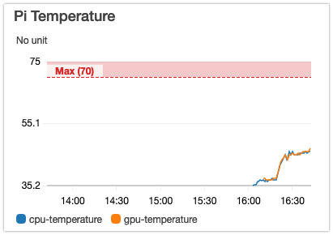

### Send CPU / GPU temperature from a raspberry-pi to AWS Cloudwatch

#### Installation

Needs:

- python3 (should be installed)
- pip `curl -O https://bootstrap.pypa.io/get-pip.py && sudo python3 getpip.py`
- aws cli `sudo pip3 install awscli --upgrade`
- environment variables for AWS CLI (added to /etc/environment):
  - `AWS_ACCESS_KEY_ID`
  - `AWS_SECRET_ACCESS_KEY`

AWS CLI version: `aws-cli/1.16.134 Python/3.5.3 Linux/4.14.62-v7+ botocore/1.12.124`

#### AWS IAM Permissions

Create a dedicated AWS API user, and attach this policy to it:

    {
        "Version": "2012-10-17",
        "Statement": [
            {
                "Sid": "VisualEditor0",
                "Effect": "Allow",
                "Action": "cloudwatch:PutMetricData",
                "Resource": "*"
            }
        ]
    }

Then create an Access Key and put the Key ID and Secret in /etc/environment.
